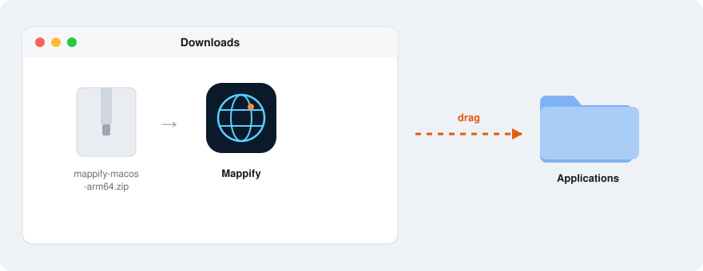
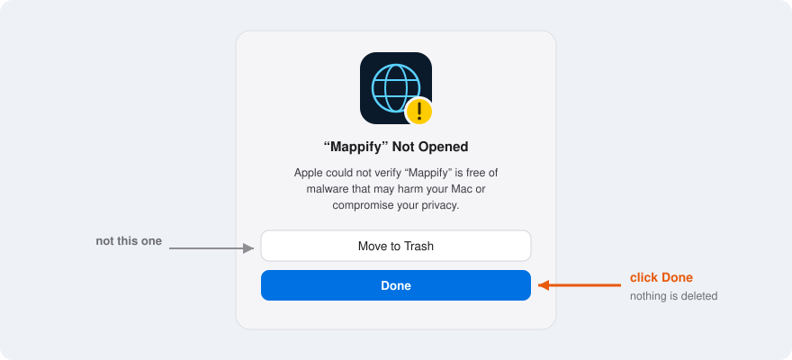
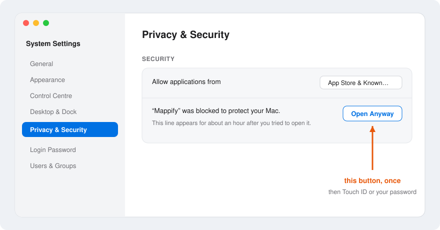
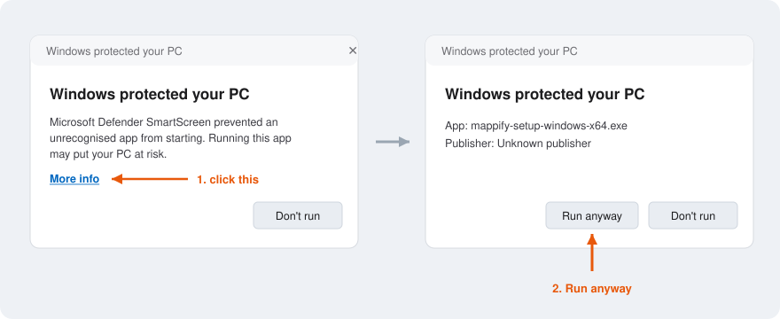
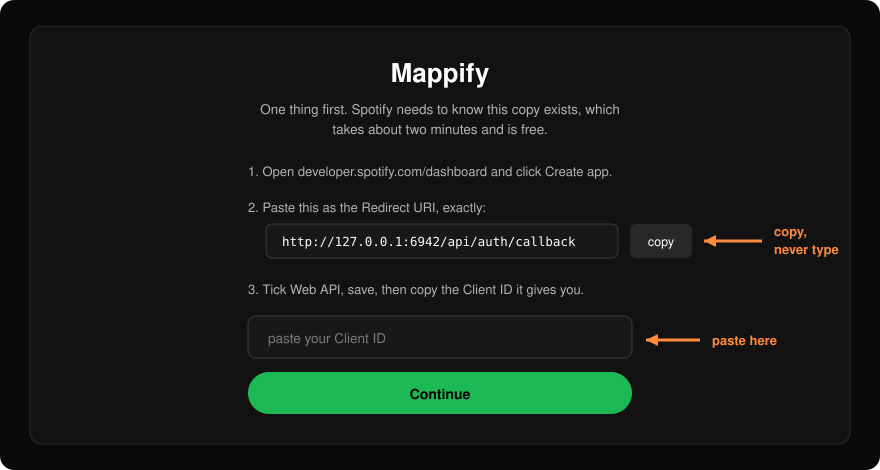
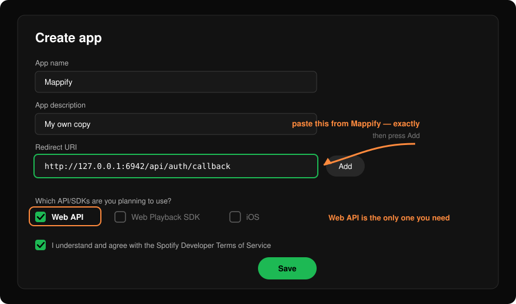
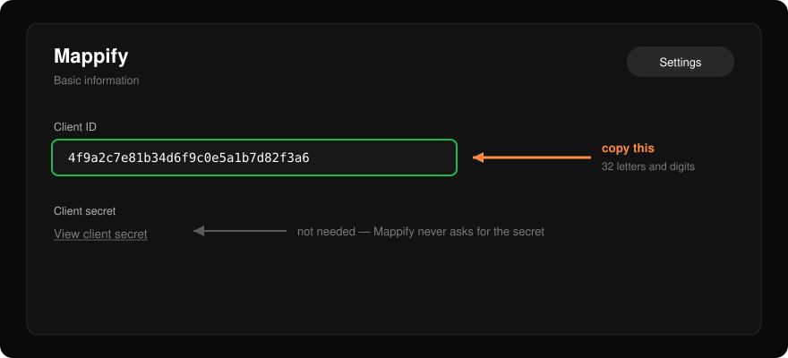

# Getting started, with pictures

Two things happen once, and only once, before Mappify works: your computer has to
be told it is allowed to open a program it has never seen, and Spotify has to be
told this copy of Mappify exists.

Neither is difficult and neither costs anything. Both look alarming the first
time, which is what this page is for. Every picture below is a drawing of what
you will see, not a photograph of your screen, so the wording may differ by a
word or two between macOS versions.

- [Opening Mappify — macOS](#opening-mappify--macos)
- [Opening Mappify — Windows](#opening-mappify--windows)
- [Opening Mappify — Linux](#opening-mappify--linux)
- [Telling Spotify about your copy](#telling-spotify-about-your-copy)
- [When something goes wrong](#when-something-goes-wrong)

---

## Opening Mappify — macOS

### 1. Unzip it and put it in Applications

Download `mappify-macos-arm64.zip` from
[Releases](https://github.com/troppochristiano/mappify/releases). Safari unzips
it for you; in any other browser, double-click the zip.

That build is for Apple Silicon — any Mac from 2020 on, which is anything with an
M1, M2, M3 or M4 in it. On an older Intel Mac, run it from the source instead:
the three commands in the [README](../README.md#run-it) work there.

What comes out is **Mappify** — one thing, not a folder. Drag it onto
**Applications** in the Finder sidebar. It works from anywhere, including the
Downloads folder, but Applications is where you will find it again.



### 2. Double-click it, and be refused

The first time, macOS will not open it. You get this, with two buttons:



**Click Done.** Not *Move to Trash*.

This looks like a dead end because there is no *Open anyway* button on it, and it
is not one — the button is somewhere else. Clicking **Done** changes nothing and
deletes nothing; it just closes the box.

> **Why this happens.** Apple checks whether an app was signed with a
> developer certificate it recognises. Mappify is not signed, because a
> certificate costs about a hundred a year plus a notarisation step, and this is
> one person's free project. macOS cannot tell "unsigned" apart from "dangerous",
> so it says the most cautious thing it can. It is the same dialog you would get
> for any small independent app.

### 3. Say "open it anyway" in System Settings

Open the **System Settings** app → **Privacy & Security** in the left sidebar →
scroll down to the **Security** section. There is a line about Mappify with an
**Open Anyway** button beside it.



Click **Open Anyway**, then confirm with Touch ID or your Mac's password. macOS
asks one more time whether you are sure — say yes, and Mappify opens.

Two things worth knowing:

- **That line disappears after about an hour.** If you get to Privacy & Security
  and there is nothing about Mappify, it has expired. Double-click Mappify again,
  click **Done** on the warning, and go straight back — the line will be there.
- **This is once, not every time.** From now on Mappify opens like anything else.

> **On older macOS** (Sonoma and earlier) there is a shortcut: right-click — or
> Control-click — the app, choose **Open**, and the same dialog appears with an
> *Open* button on it. macOS Sequoia removed that route, which is why the first
> warning now looks final when it is not.

<details>
<summary>The one-line version, if you are comfortable in Terminal</summary>

This does the same thing as steps 2 and 3 in one go — it removes the "downloaded
from the internet" flag that makes macOS ask:

```bash
xattr -dr com.apple.quarantine /Applications/Mappify.app
```

Then open Mappify normally. Nothing else about the app changes.

</details>

### What opening it looks like

There is no Terminal window and nothing to close afterwards. Mappify appears in
the Dock, and the globe opens in a window of its own. Quitting it from the Dock
stops it completely.

If double-clicking appears to do nothing at all, the reason is in
`~/Library/Logs/Mappify.log` — see [When something goes
wrong](#when-something-goes-wrong).

---

## Opening Mappify — Windows

Download **`mappify-setup-windows-x64.exe`** and run it. It installs into your
own user folder, so it never asks for an administrator password, and it puts
Mappify in the Start menu and on the desktop.

Windows will stop it once, because the installer is not code-signed either.
Click **More info**, which reveals a **Run anyway** button:



If *More info* is missing, the dialog is a different one — Defender rather than
SmartScreen. That should not happen with this build; if it does, please
[open an issue](https://github.com/troppochristiano/mappify/issues).

**The `.zip` beside it** is the same app without installing: unzip the whole
folder somewhere and double-click **Mappify** inside it. Keep the folder
together — the shortcut runs the copy of Node sitting next to it — and expect its
icon to be blank until the first time you open it.

A small terminal window opens minimised and stays there while Mappify runs.
Leave it alone; closing it stops the app. The browser window is safe to close and
reopen as often as you like.

---

## Opening Mappify — Linux

Unzip the folder and double-click **Mappify.desktop**. Most desktops refuse to
run a downloaded launcher until you allow it: in the file's Properties, tick
**Allow executing file as program** (GNOME also has **Allow Launching** in the
right-click menu), then open it.

Or skip that entirely and run `./Mappify.command` from a terminal in the folder.
It is the same script, and it prints anything that goes wrong.

---

## Telling Spotify about your copy

Mappify opens on this screen the first time. It is asking for one thing: a
**Client ID**, which is a free code that identifies your own copy to Spotify.



Keep that window open. You are about to copy something out of it and something
else back into it.

> **Why you have to do this at all.** Spotify refuses to talk to an application
> it has never heard of, and since February 2026 an app that has not been through
> its review process is limited to five users. Registering your own means you are
> the developer of your own copy and one of your own five — no queue, no review,
> nothing shared with anyone else.
>
> Registering an app is free and takes about two minutes. It does not give
> anyone, including me, access to your account.

### 1. Create the app

Go to [developer.spotify.com/dashboard](https://developer.spotify.com/dashboard)
and sign in with your normal Spotify account. Click **Create app**.



- **App name** and **description** — anything at all. Nobody sees them but you.
- **Redirect URI** — this one matters. Click **copy** in the Mappify window and
  paste it here, then press **Add** so it appears in the list below the field.
  It must match exactly, character for character, which is why there is a copy
  button rather than something to type.
- **Which API/SDKs** — tick **Web API**. Leave the rest.
- Tick the terms box and click **Save**.

### 2. Copy the Client ID back

Spotify now shows your app's page. The **Client ID** is on it — a long string of
letters and numbers, sometimes behind a **Settings** button on the app page.



Copy it, paste it into the box in Mappify, and click **Continue**. There is also
a **client secret** on that page: Mappify never uses it, and you should not paste
it anywhere.

### 3. Connect

Click **Connect Spotify**, approve the permissions Spotify lists, and the import
starts. Most libraries are on the globe within a minute or so.

You stay signed in afterwards — closing Mappify and opening it later lands you
back on your globe, and reconnecting later never re-imports from scratch.

---

## When something goes wrong

**"INVALID_CLIENT: Invalid redirect URI"** — the URI in the Spotify dashboard
does not match the one Mappify asks with. Nearly always one of: it was typed
rather than pasted, **Add** was never pressed so it was never saved, or there is
a stray space at the end. Copy it out of Mappify again and re-add it.

**Mappify says the port moved.** Mappify normally runs on port 6942 and the
redirect URI ends `127.0.0.1:6942`. If something else on your machine already
holds that port, Mappify moves and Spotify then refuses the sign-in, because the
address no longer matches. Quit whatever else is using 6942 and reopen Mappify.

**A friend's copy asks to be authorised.** If you are signing in to *someone
else's* running instance rather than your own, your Spotify account has to be
added under **Users and Access** in their dashboard first — Spotify's five-user
limit, not Mappify's. Running your own copy avoids it entirely.

**Nothing happens when you open it — macOS.** The app writes everything to
`~/Library/Logs/Mappify.log`. Open it with Console.app, or in Terminal:

```bash
tail -40 ~/Library/Logs/Mappify.log
```

**Nothing happens when you open it — Windows.** Open the Mappify folder in a
terminal and run the shortcut's own command, which leaves the error on screen:

```
runtime\node.exe tools\start.js
```

The usual answer is that Mappify is already running: it will not start twice.

**Still stuck?** [Open an issue](https://github.com/troppochristiano/mappify/issues)
with what you saw — the exact wording of any dialog is enough to identify it.
